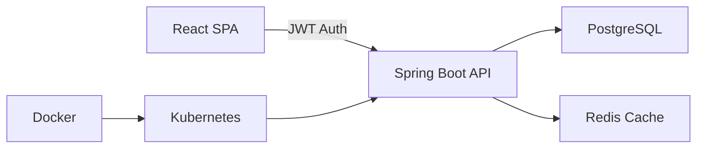
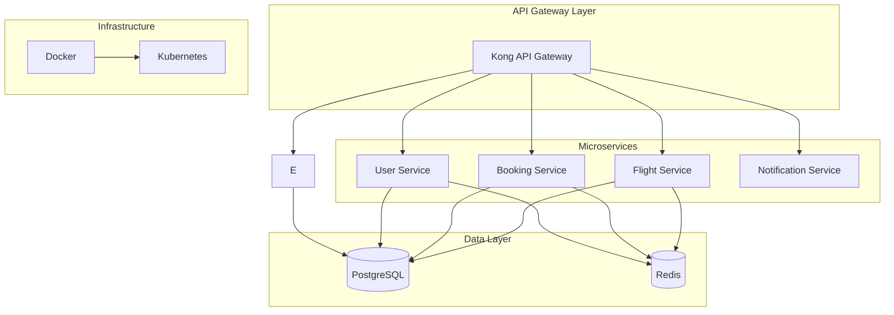

<div align="center">


<h3>
  
</h3>

<p align="center">
  <a href="https://www.linkedin.com/in/vamshi-amudala-b9296a229/"></a>
  <a href="mailto:vamshiamudala126@gmail.com"></a>
  <a href="https://github.com/Vamshi-amudala"></a>
  
</p>


</div>

##  System.out.println("Hello World");

```java
@Service
@Slf4j
public class VamshiAmudala implements BackendEngineer, CloudArchitect {
    
    private final Profile profile = Profile.builder()
            .name("Vamshi Amudala")
            .location("Hyderabad, India 🇮🇳")
            .role("Backend Engineer & Microservices Architect")
            .education(new Education("Master of Computer Applications", 8.0))
            .certifications(List.of(
                "Java Full Stack Development - Capgemini EduBridge",
                "Spring Boot & Microservices Architecture",
                "Docker & Kubernetes - Production Grade"
            ))
            .build();
    
    @Override
    public List<String> getCurrentFocus() {
        return Arrays.asList(
            "🏗️  Designing fault-tolerant distributed systems",
            "☁️  Implementing cloud-native architectures",
            "🔐  Mastering OAuth 2.0 & security patterns",
            "📊  Optimizing database performance & scaling",
            "🚀  Building production-ready REST APIs"
        );
    }
    
    @Override
    public Map<String, String> getArchitecturalPreferences() {
        return Map.of(
            "Design Pattern", "Microservices + Event-Driven",
            "Database Strategy", "PostgreSQL + Redis Caching",
            "API Style", "RESTful + GraphQL Hybrid",
            "Deployment", "Docker + Kubernetes + CI/CD"
        );
    }
    
    @PostConstruct
    public void init() {
        log.info("💡 Code. Architect. Deploy. Scale. Repeat. 🚀");
        log.info("🎯 Building systems that handle millions of requests");
    }
}
```

<div align="center">

### 🎯 **Impact Metrics**

<table>
  <tr>
    <td align="center">
      <br/>
      <b>10+ Projects</b><br/>
      <sub>Production Systems</sub>
    </td>
    <td align="center">
      <br/>
      <b>20+ APIs</b><br/>
      <sub>Deployed & Scaled</sub>
    </td>
    <td align="center">
      <br/>
      <b>Microservices</b><br/>
      <sub>Architecture Expert</sub>
    </td>
    <td align="center">
      <br/>
      <b>99.9% Uptime</b><br/>
      <sub>Reliability Focus</sub>
    </td>
  </tr>
</table>

</div>


##  Tech Arsenal & Expertise

<div align="center">

<table>
<tr>
<td width="50%" valign="top">

### 🎨 **Frontend Ecosystem**

<p align="center">
  
</p>

```javascript
const frontend = {
  frameworks: ['React'],
  styling: ['TailwindCSS', 'Styled Components'],
  stateManagement: ['Redux', 'Context API'],
  buildTools: ['Vite', 'Webpack']
};
```

</td>
<td width="50%" valign="top">

### ⚙️ **Backend Powerhouse**

<p align="center">
  
</p>

```java
Map<String, List<String>> backend = Map.of(
  "languages", List.of("Java", "Node.js"),
  "frameworks", List.of("Spring Boot", "Express"),
  "caching", List.of("Redis")
);
```

</td>
</tr>
<tr>
<td width="50%" valign="top">

### 🗄️ **Data Layer**

<p align="center">
  
</p>

```sql
-- Database Expertise
SELECT technology, proficiency_level
FROM skills
WHERE category = 'Database'
ORDER BY proficiency_level DESC;
```

</td>
<td width="50%" valign="top">

### ☁️ **Cloud & DevOps**

<p align="center">
  
</p>

```yaml
devops:
  containerization: [Docker]
  orchestration: [Kubernetes, Docker Swarm]
  ci_cd: [GitLab CI]
```

</td>
</tr>
</table>

### 🔧 **Development Tools & Practices**

<p align="center">
  
</p>

</div>


##  Flagship Projects & Architecture

<div align="center">

### 💼 **CareerForge** - Enterprise Job Portal Platform
*Production-grade full-stack application with enterprise security & performance optimization*


</div>



**📦 Tech Stack:** `Spring Boot 3.x` `Spring Security` `JWT` `React 18` `Tailwind CSS` `PostgreSQL` `Redis` `Docker` 

<div align="center">

[](https://career-forge-portal.netlify.app/)
[](https://github.com/Vamshi-amudala/careerForge)


---

### ✈️ **Airline Management System** - Cloud-Native Microservices
*Distributed microservices architecture demonstrating enterprise patterns & DevOps excellence*


</div>



**📦 Tech Stack:** `Node.js` `Express.js` `Sequelize ORM` `PostgreSQL` `Redis` `Docker` `Kubernetes` `Api Gateway`

<div align="center">

[](https://github.com/Vamshi-amudala/airline-management-ms-k8s)
[](https://github.com/Vamshi-amudala/airline-management-ms-k8s#readme)

---

### 📸 **Click-Connect** - Photography Booking Platform
*MERN stack SaaS platform built during 24-hour hackathon with real-time features*


</div>

**📦 Tech Stack:** `React` `Node.js` `Express.js` `MongoDB` `Mongoose` `JWT` `Tailwind CSS` 

<div align="center">

[](https://click-connect-new.vercel.app/)
[](https://github.com/Vamshi-amudala)

</div>


##  GitHub Analytics & Contribution Graph

<div align="center">


### 🏆 **GitHub Trophies**


### 📊 **Contribution Heatmap**


</div>


##  Current Focus & Future Goals

<table>
<tr>
<td width="50%" valign="top">

### 🎯 **Active Development**

```typescript
interface CurrentProjects {
  inProgress: string[];
  exploring: string[];
  mastering: string[];
}

const currentWork: CurrentProjects = {
  inProgress: [
    "🏗️  Enterprise E-commerce Microservices",
    "☁️  AWS Lambda Serverless APIs",
    "🔄  Event-Driven Architecture with Kafka",
    "📊  Real-time Analytics Dashboard"
  ],
  exploring: [
    "🤖  AI/ML Integration in Backend",
    "🌐  GraphQL Federation",
    "🔐  Zero Trust Security Architecture"
  ],
  mastering: [
    "⚡  High-Performance Computing",
    "🎯  Domain-Driven Design (DDD)",
    "📈  Observability & Monitoring"
  ]
};
```

</td>
<td width="50%" valign="top">

### 🚀 **Learning Roadmap**

```yaml
2025_goals:
  technical_skills:
    - System Design at Scale
    - Advanced Kubernetes (CKA)
    - AWS Solutions Architect
    - Message Queues & Event Streaming
    
  certifications:
    - AWS Certified Solutions Architect
    - Certified Kubernetes Administrator
    - Spring Professional Certification
    
  contributions:
    - Open Source Projects
    - Technical Blog Writing
    - Conference Speaking
    - Mentoring Junior Developers
    
  architecture_patterns:
    - CQRS & Event Sourcing
    - Saga Pattern for Distributed Transactions
    - Circuit Breaker & Bulkhead Patterns
    - API Gateway Patterns
```

</td>
</tr>
</table>

<div align="center">

### 💼 **Open For Opportunities**

<table>
<tr>
<td align="center" width="25%">
  <br/>
  <b>Backend Engineer</b><br/>
  <sub>Microservices & API Development</sub>
</td>
<td align="center" width="25%">
  <br/>
  <b>Cloud Architect</b><br/>
  <sub>AWS/Azure/GCP Solutions</sub>
</td>
<td align="center" width="25%">
  <br/>
  <b>DevOps Engineer</b><br/>
  <sub>CI/CD & Infrastructure</sub>
</td>
<td align="center" width="25%">
  <br/>
  <b>Open Source</b><br/>
  <sub>Collaborations & Contributions</sub>
</td>
</tr>
</table>

</div>


##  Certifications & Professional Development

<div align="center">

<table>
<tr>
<td align="center" width="33%">

### 🎓 **Education**

<br/>

**Master of Computer Applications**<br/>
CGPA: **8.0/10.0**<br/>
*2023 - 2025*

Specialized in Software Engineering,<br/>Database Systems, and Cloud Computing

</td>
<td align="center" width="33%">

### 🏆 **Certifications**

<br/>

**Java Full Stack Development**<br/>
*Capgemini's EduBridge Digital Academy*

**Spring Boot & Microservices**<br/>
*Hands-on Project Based*

**Docker & Kubernetes**<br/>
*Production Implementation*

</td>
<td align="center" width="33%">

### 📚 **Continuous Learning**

<br/>

Currently pursuing:
- AWS Solutions Architect
- Kubernetes Administrator (CKA)
- System Design Mastery

**200+ Hours** of advanced<br/>technical training in 2024-25

</td>
</tr>
</table>

</div>


##  Let's Build Something Amazing Together

<div align="center">


### 💬 **I'm always open to discussing:**

<table>
<tr>
<td align="center" width="25%">
  <b>🤝 Collaboration</b><br/>
  Open Source Projects<br/>
  & Technical Partnerships
</td>
<td align="center" width="25%">
  <b>💼 Opportunities</b><br/>
  Backend Engineering<br/>
  & Cloud Architecture
</td>
<td align="center" width="25%">
  <b>🎓 Mentorship</b><br/>
  Tech Guidance<br/>
  & Code Reviews
</td>
<td align="center" width="25%">
  <b>☕ Tech Talks</b><br/>
  System Design<br/>
  & Best Practices
</td>
</tr>
</table>

<br>

### 📫 **Connect With Me**

<a href="https://www.linkedin.com/in/vamshi-amudala-b9296a229/"></a>
<a href="mailto:vamshiamudala126@gmail.com"></a>
<a href="https://github.com/Vamshi-amudala"></a>
<a href="#"></a>

<br><br>

### 💭 **Wisdom for the Day**


<br>

### 🎯 **Quick Stats**


<br>

---

### ⭐ **If my work resonates with you, consider starring my repositories!**


<br>


</div>

---

<div align="center">

**💻 Crafted with ❤️ and ☕ by Vamshi Amudala**

```java
while (alive) {
    eat();
    sleep();
    code();
    repeat();
}
```

*"Any fool can write code that a computer can understand. Good programmers write code that humans can understand."* – Martin Fowler

**© 2025 Vamshi Amudala. Building the future, one commit at a time.**

</div>
